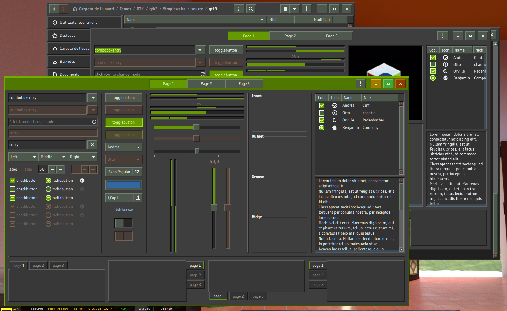
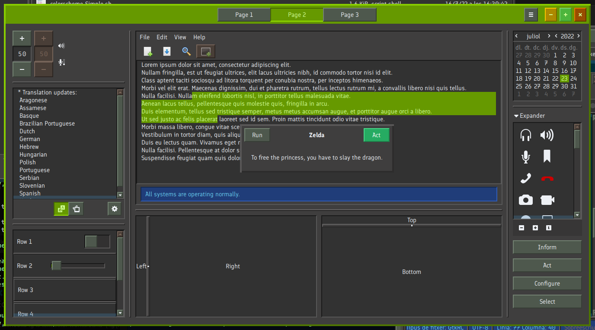
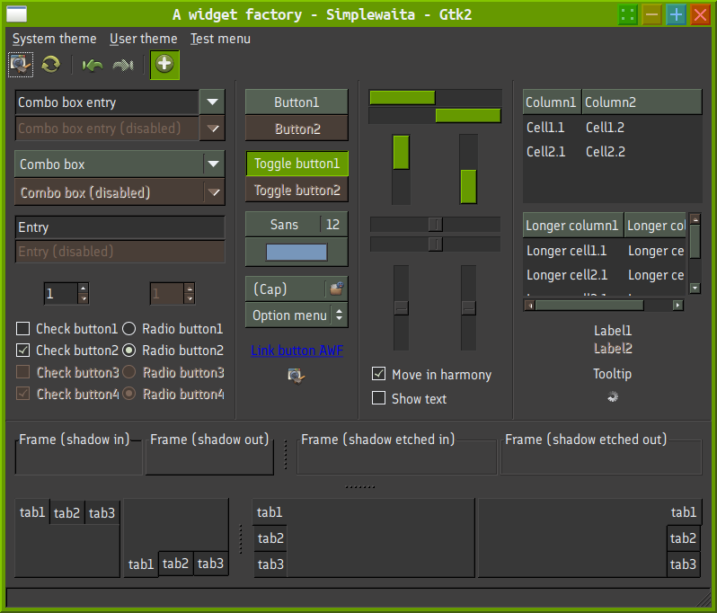
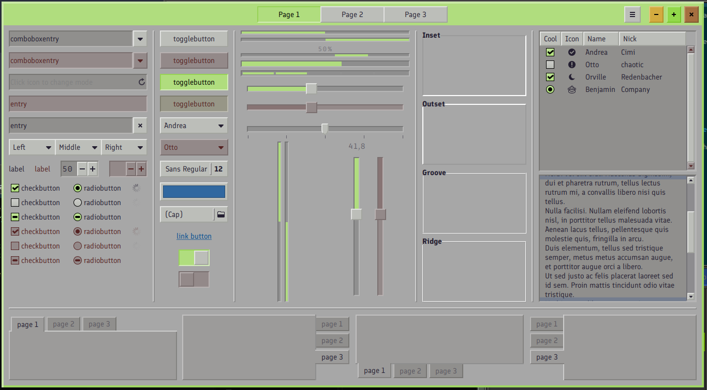

# Simplewaita

This is a very complete theme, including:
- GTK2, GTK3 and GTK4
- Kvantum (qt svg theme, qorks with both qt5 and qt6)
- qtCurve configuration (qtcurve for now it works only in qt5)
- Plasma, qt5ct and qt6ct color schemes
- xfwm4 theme (XFCE window decoration)
- Aurorae theme (Plasma (Kwin) window decoration)
- Plasma theme
- Metacity (Mate window decoration)
- Openbox (window decoration for Openbox window manager)

It is a skeuomorphic theme (that is, non-flat, that tries to imitate real-world objects and interfaces, like real three-dimensional buttons). It tries to use as little CPU as possible to draw widgets (no round corners, no gradients, almost no box-shadows and almost no transparency, except where it is unavoidable to keep usability). It also tries to be extremely _legible_, that is: the function of every element should be obvious. I have decided to make a compromise, though: toolbar buttons (and a few others) are not raised by default (because in some apps it may make the UI look too crowded, like "too many things happening").
Because of these design decisions, it looks very much like a theme from the 90s. It may even have som pixel art flavor too, beacuse all borders are two pixels wide, and relief is widely used to help distinguish elements.

This theme's colors are equal to Simple theme, which are very similar to another theme of mine called Soil. That is: dark theme, with gray backgrounds, green accents, brown disabled elements, and blue hints or statuses. Buttons are lighter and subtly green.

This theme is based on Adwaita GTK3 and GTK4 (source sasscs!) and built from there. Sources are also available.

GTK2 is based on Clearlooks.

I've created a way to use different color themes:

- go to `source/templates/` directory and run `./use_scheme.sh name_of_color_scheme` (for example: `./use_scheme.sh colorscheme-Skewaita_original_light.sh`
- move one directory upwards with `cd ..` and rebuild theme, using new selected scheme, and bearing in mind whether it's a light or a dark theme: `./compile.sh light` or `./compile.sh dark`

For now there are only two color schemes: the original one and a light one (using Skewaita's colors).

## Integration with other DE

To integrate this theme with Plasma or QT: You can either download corresponding Simple themes using Plasma Configuration tool, or, if you prefer to use the cloned repo, then:

- Plasma:
  - import the color scheme in `kde_plasma_qt/plasma_colorscheme/` folder.
  - With Kvantum manager, either import `kde_plasma_qt/Kvantum/Simplewaita/` with the Kvantum Manager, or create a symbolic link to `kde_plasma_qt/Kvantum/Simplewaita/` in `~/.config/Kvantum`.
  - create a symbolic link to `kde_plasma_qt/aurorae/Simple/` called `Simple` at `~/.local/share/aurorae/themes`
- Other QT desktops:
  - copy Simple.conf in `kde_plasma_qt/qt5_or_6ct_color_scheme/` to `~/.config/qt5ct/colors` (to activate it, you need to use qt5ct or qt6ct to manage the aspect of your QT applications)
  - Do the same as with Plasma for Kvantum
- Gnome 42 and libadwaita: link or copy its `Simplewaita/gtk-4.0/gtk.css` to `~/.config/gtk-4.0/gtk.css` and the folder `Simplewaita/gtk-4.0/assets` to `~/.config/gtk-4.0/assets` (linking is the recommended option, especially if you use the cloned repo).

(note: you can also use the strategy of creating symbolic links for Kvantum and color scheme).

For GTK, metacity, xfwm4, openbox and Unity, just copy the root folder in `~/.themes` (or, if you want it to be available to all users, `/usr/share/themes`). If you clone the repo, then I'd recommend to create a symbolic link to Simplewaita's folder in `~/.themes`, instead of copying it, so you just need to `git pull` in order to fully update it.

## Big previews:

